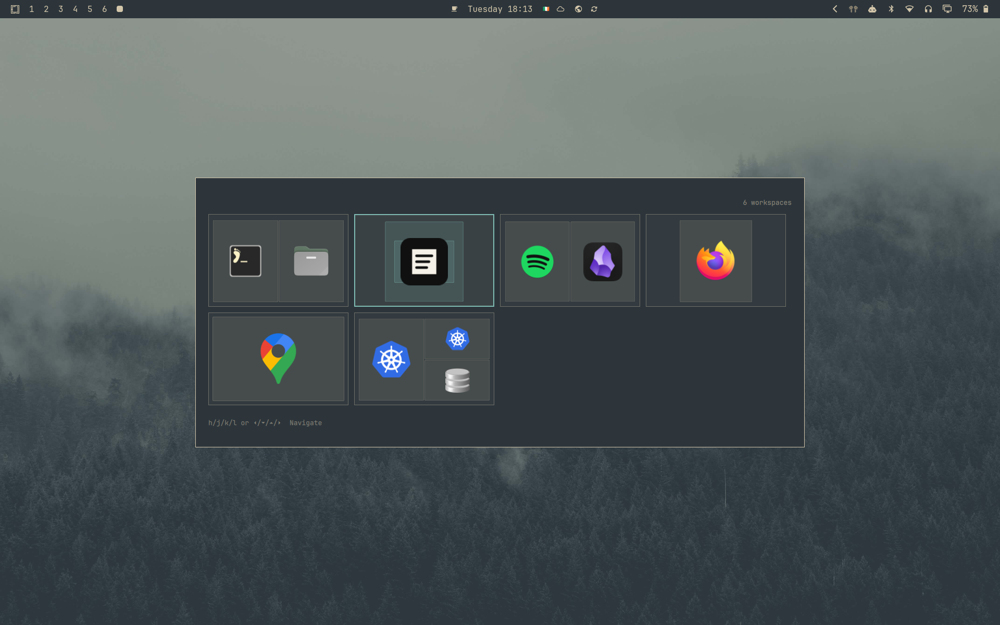
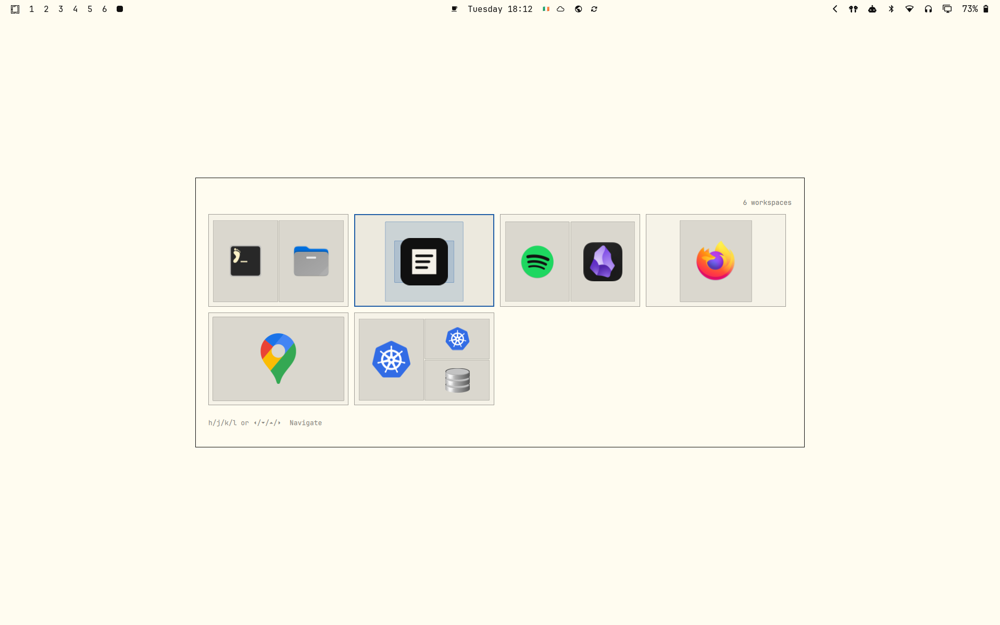

# Switcharoo - Omarchy switcher plugin

A native [Omarchy](https://omarchy.org/) shell plugin for switching between Hyprland windows.



## Features

- Most-recently-used window ordering from Hyprland's `focusHistoryID`
- Vim navigation (`h`, `j`, `k`, `l`) and arrow-key navigation
- Grid navigation with wrapping
- Close the selected client with `q`, `Delete`, or middle-click
- Switch between windows or workspaces
- Current-monitor, current-workspace, and same-class filters
- Omarchy theme colors, spacing, fonts, and corner radius

## Install

```bash
omarchy plugin add https://github.com/gabrielvincent/omarchy-switcharoo.git --enable
```

## Bind Alt+Tab

Omarchy already binds `ALT + TAB` and `ALT + SHIFT + TAB` to immediate window cycling. The plugin ships its replacements in [`switcharoo-bindings.lua`](switcharoo-bindings.lua).

Create `~/.config/hypr/bindings/switcharoo.lua` and paste in:

```lua
-- switcharoo-bindings.lua — bindings to inject into the Hyprland Lua config
-- (~/.config/hypr/customisation.lua or bindings.lua), Hyprland ≥ 0.56.

-- The "Switcharoo switcher" description acts as a sentinel: the plugin checks
-- for it in `hyprctl binds` to detect that the binding is installed.
hl.unbind("ALT + TAB")
o.bind("ALT + TAB", "Switcharoo switcher", hl.dsp.global("omarchy-switcharoo:next"), { repeating = true })

hl.unbind("ALT + SHIFT + TAB")
o.bind("ALT + SHIFT + TAB", "Switcharoo switcher", hl.dsp.global("omarchy-switcharoo:previous"), { repeating = true })

hl.unbind("ALT + GRAVE")
o.bind("ALT + GRAVE", "Switcharoo switcher", hl.dsp.global("omarchy-switcharoo:previous"), { repeating = true })

hl.layer_rule({ match = { namespace = "omarchy-switcharoo" }, no_anim = true })
```

Then add this single line to `~/.config/hypr/bindings.lua`:

```lua
require("./bindings/switcharoo.lua")
```

The bindings map `ALT + TAB` to the plugin's `omarchy-switcharoo:next` global shortcut, and `ALT + SHIFT + TAB` / `ALT + GRAVE` to `omarchy-switcharoo:previous`. They also disable compositor animation for the overlay. The plugin registers those shortcuts while it is loaded; the Lua bindings just dispatch to them.

If the plugin starts without finding the `"Switcharoo switcher"` binding, it shows a notification (clicking it opens this README).

The shortcuts should appear in `hyprctl globalshortcuts`, and the `ALT + TAB` entries should appear in `hyprctl binds`.

## Remove

The plugin manager does not remove custom Hyprland configuration. Before removing the plugin:

1. Remove `require("./bindings/switcharoo.lua")` from `~/.config/hypr/bindings.lua`.
2. Remove the binding file:

   ```bash
   rm ~/.config/hypr/bindings/switcharoo.lua
   ```

3. Disable and remove the plugin:

   ```bash
   omarchy plugin remove io.github.gabrielvincent.switcharoo --yes
   ```

## Configure

Third-party plugin settings live on the plugin entry in `~/.config/omarchy/shell.json`. `omarchy plugin enable` creates the entry; add any settings you want to override:

```json
{
  "id": "io.github.gabrielvincent.switcharoo",
  "commitOnModifierRelease": true,
  "switchMode": "clients",
  "showWorkspace": false,
  "showSpecialWorkspaceBadge": true,
  "dimBackdrop": false,
  "itemsPerRow": 4,
  "maxVisibleRows": 3,
  "filterBy": [],
  "excludeWorkspaces": [],
  "killKey": "q",
  "wrapNavigation": true
}
```

Supported settings:

| Setting | Default | Description |
|---|---:|---|
| `switchMode` | `"clients"` | Switch `clients` or `workspaces`. Workspace mode lists workspaces and activates the selection, previewing each workspace's tiled client layout. Special workspaces are marked with a `special` badge when enabled. |
| `itemsPerRow` | `4` | Maximum cells in each row (1–12). `maxItemsPerRow` is accepted as an alias. |
| `maxVisibleRows` | `3` | Maximum rows before the grid scrolls. |
| `filterBy` | `[]` | Any combination of `current_monitor`, `current_workspace`, and `same_class`; use `[]` for all windows. |
| `excludeWorkspaces` | `[]` | Workspace-name regular expressions to exclude. In client mode, clients on matching workspaces are hidden; in workspace mode, matching workspaces are hidden. |
| `killKey` | `"q"` | One-character key used to close the selected client. |
| `showWorkspace` | `false` | Show the workspace name below each title in client mode and the workspace number/name label on workspace cards in workspace mode. `showWorkspaceNumbers` is accepted as an alias. |
| `showSpecialWorkspaceBadge` | `true` | Show the `special` badge on special workspace cards in workspace mode. |
| `dimBackdrop` | `false` | Dim the desktop behind the switcher. |
| `wrapNavigation` | `true` | Wrap at grid edges. |
| `commitOnModifierRelease` | `true` | Focus selection when Alt is released. |

A summon payload can temporarily override any setting. For example:

```bash
omarchy-shell shell summon io.github.gabrielvincent.switcharoo \
  '{"itemsPerRow":3,"filterBy":[],"direction":"previous"}'
```

## Controls

| Keys | Action |
|---|---|
| `h` / Left / Shift+Tab | Previous cell |
| `l` / Right / Tab | Next cell |
| `j` / Down | Cell below |
| `k` / Up | Cell above |
| Enter / Space | Focus the selected client or workspace |
| `q` / Delete | Close selected client (client mode only) |
| `m` | Minimize the selected client or workspace; in minimized view, restore the selected item without leaving the switcher. Clients go to `special:switcharoo_minimized`; workspaces are parked in dedicated Switcharoo special workspaces. |
| Shift + `m` | Toggle the minimized-only view. Enter / Space restores its selected client or workspace to its original workspace. |
| Escape | Cancel |
| Left click | Focus client |
| Middle click | Close client |

## Development

```bash
omarchy plugin validate .
QT_QPA_PLATFORM=offscreen /usr/lib/qt6/bin/qmltestrunner -input tests
```

The plugin entry point is [`Switcher.qml`](Switcher.qml); pure configuration, filtering, MRU sorting, and grid-navigation logic lives in [`WindowModel.js`](WindowModel.js).

## License

MIT. [LICENSE](LICENSE).
